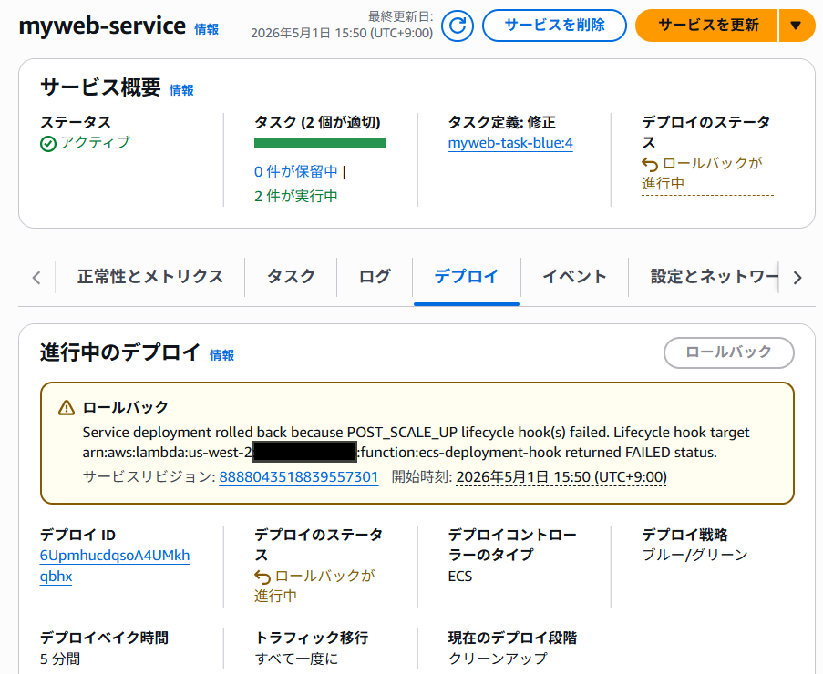

# ECS Blue/Green デプロイメント

## 概要

このプロジェクトは、Amazon ECS の Blue/Green デプロイメントを検証します。

* フォルダ構成

- **lambda** — Blue/Green デプロイ時の検証に使用する Lambda 関数のサンプルコード 
- **myweb1** — Blue Page（背景色：青、フォント色：白）を表示するコンテナイメージ構築用
- **myweb2** — Green Page（背景色：緑、フォント色：白）を表示するコンテナイメージ構築用
- **ecs-infrastructure.yaml** — Amazon ECS クラスター環境を構築する CloudFormation テンプレート

## 前提条件

- Docker がインストールされていること
- AWS CLI がインストール・設定済みであること
- Amazon ECS や Amazon ECR やそれらの関連リソースを作成できるポリシーが付与された ID で AWS アカウントを使用できること 

## 手順：myweb1 のコンテナイメージをビルドして ECR に Push する

### 1. 環境変数の設定

以下の環境変数を自身の環境に合わせて設定してください。

```bash
export AWS_ACCOUNT_ID=123456789012
export AWS_REGION=ap-northeast-1
```

### 2. ECR リポジトリの作成（未作成の場合）

```bash
aws ecr create-repository --repository-name myweb --region $AWS_REGION
```

### 3. ECR にログイン

```bash
aws ecr get-login-password --region $AWS_REGION | docker login --username AWS --password-stdin $AWS_ACCOUNT_ID.dkr.ecr.$AWS_REGION.amazonaws.com
```

### 4. Docker イメージのビルド

```bash
docker build -t myweb myweb1/
```

```bash
docker build -t myweb:green myweb2/
```

### 5. イメージにタグを付与

```bash
docker tag myweb:latest $AWS_ACCOUNT_ID.dkr.ecr.$AWS_REGION.amazonaws.com/myweb:blue
```

```bash
docker tag myweb:green $AWS_ACCOUNT_ID.dkr.ecr.$AWS_REGION.amazonaws.com/myweb:green
```


### 6. ECR にイメージを Push

```bash
docker push $AWS_ACCOUNT_ID.dkr.ecr.$AWS_REGION.amazonaws.com/myweb:blue
```

```bash
docker push $AWS_ACCOUNT_ID.dkr.ecr.$AWS_REGION.amazonaws.com/myweb:green
```


### 7. Push されたイメージの確認

```bash
aws ecr list-images --repository-name myweb --region $AWS_REGION
```

## CloudFormation で ECS 環境を構築する

`ecs-infrastructure.yaml` を使って、VPC・ALB・ECS クラスター・ECS サービスを一括で作成します。

### 8. CloudFormation スタックの作成

```bash
aws cloudformation create-stack \
  --stack-name ecs-blue-green \
  --template-body file://ecs-infrastructure.yaml \
  --capabilities CAPABILITY_NAMED_IAM \
  --region $AWS_REGION
```

### 9. スタック作成の進捗確認

作成完了まで数分かかります。以下のコマンドでステータスを確認できます。

```bash
aws cloudformation describe-stacks --stack-name ecs-blue-green --query "Stacks[0].StackStatus" --region $AWS_REGION
```

`CREATE_COMPLETE` と表示されれば作成完了です。

### 10. ALB の DNS 名を取得

```bash
aws cloudformation describe-stacks --stack-name ecs-blue-green --query "Stacks[0].Outputs[?OutputKey=='ALBDNSName'].OutputValue" --output text --region $AWS_REGION
```

取得した DNS 名にブラウザでアクセスすると、Blue Page が表示されます。

## ライフサイクルフックによるロールバック検証

テンプレートには、デプロイの POST_SCALE_UP ステージで Lambda 関数を呼び出すライフサイクルフックが設定されています。
Lambda 関数の環境変数 `VALIDATION_RESULT` のデフォルト値は `SUCCESS` のため、スタック作成時の Blue デプロイは正常に完了します。

ここでは、環境変数を AWS CLI で切り替えることで、ロールバックと成功の両方を検証します。

### シナリオ 1：Lambda の環境変数を FAIL に変更してデプロイを失敗させる

#### 11. Lambda の環境変数を FAIL に変更

```bash
aws lambda update-function-configuration \
  --function-name ecs-deployment-hook \
  --environment "Variables={VALIDATION_RESULT=FAIL}" \
  --region $AWS_REGION
```

#### 12. Green にデプロイを実行

```bash
GREEN_TASK_DEF=$(aws cloudformation describe-stacks --stack-name ecs-blue-green --query "Stacks[0].Outputs[?OutputKey=='TaskDefinitionGreenArn'].OutputValue" --output text --region $AWS_REGION)

aws ecs update-service \
  --cluster ECS-VPC \
  --service myweb-service \
  --task-definition $GREEN_TASK_DEF \
  --region $AWS_REGION
```

POST_SCALE_UP ステージで Lambda が `FAILED` を返し、ECS が自動的に Blue にロールバックします。

#### 13. デプロイのステータスを確認

```bash
aws ecs describe-services --cluster ECS-VPC --services myweb-service --query "services[0].deployments" --region $AWS_REGION
```



ロールバック後、ALB の DNS 名にアクセスすると引き続き Blue Page が表示されます。

#### 14. Lambda のログを確認

```bash
aws logs tail /aws/lambda/ecs-deployment-hook --follow --region $AWS_REGION
```

ログに「検証失敗: デプロイをロールバックします」と出力されていることを確認します。確認後、`Ctrl + C` でログの表示を終了します。

### シナリオ 2：Lambda の環境変数を SUCCESS に戻してデプロイを成功させる

#### 15. Lambda の環境変数を SUCCESS に変更

```bash
aws lambda update-function-configuration \
  --function-name ecs-deployment-hook \
  --environment "Variables={VALIDATION_RESULT=SUCCESS}" \
  --region $AWS_REGION
```

#### 16. 再度 Green にデプロイを実行

```bash
aws ecs update-service \
  --cluster ECS-VPC \
  --service myweb-service \
  --task-definition $GREEN_TASK_DEF \
  --region $AWS_REGION
```

今度は Lambda が `SUCCEEDED` を返し、デプロイが続行されます。

#### 17. デプロイの進捗確認

```bash
aws ecs describe-services --cluster ECS-VPC --services myweb-service --query "services[0].deployments" --region $AWS_REGION
```

Bake Time（5分）の間は Blue と Green の両方が稼働しており、問題があればロールバック可能です。Bake Time 経過後、Blue 環境が終了しデプロイが完了します。

ALB の DNS 名にアクセスすると Green Page が表示されます。

### 18. スタックの削除（不要になった場合）

```bash
aws cloudformation delete-stack --stack-name ecs-blue-green --region $AWS_REGION
```


## 参考ドキュメント

- [Amazon ECS blue/green deployments](https://docs.aws.amazon.com/AmazonECS/latest/developerguide/deployment-type-blue-green.html) — ECS 組み込み Blue/Green デプロイの概要
- [Amazon ECS blue/green service deployments workflow](https://docs.aws.amazon.com/AmazonECS/latest/developerguide/blue-green-deployment-how-it-works.html) — デプロイのライフサイクルとワークフロー
- [Creating an Amazon ECS blue/green deployment](https://docs.aws.amazon.com/AmazonECS/latest/developerguide/deploy-blue-green-service.html) — Blue/Green デプロイの作成手順
- [Required resources for Amazon ECS blue/green deployments](https://docs.aws.amazon.com/AmazonECS/latest/developerguide/blue-green-deployment-implementation.html) — 必要なリソースとベストプラクティス
- [Application Load Balancer resources for blue/green deployments](https://docs.aws.amazon.com/AmazonECS/latest/developerguide/alb-resources-for-blue-green.html) — ALB の設定要件
- [Amazon ECS infrastructure IAM role for load balancers](https://docs.aws.amazon.com/AmazonECS/latest/developerguide/AmazonECSInfrastructureRolePolicyForLoadBalancers.html) — ロードバランサー管理用 IAM ロール
- [Troubleshooting Amazon ECS blue/green deployments](https://docs.aws.amazon.com/AmazonECS/latest/developerguide/troubleshooting-blue-green.html) — トラブルシューティング
- [Lifecycle hooks for Amazon ECS service deployments](https://docs.aws.amazon.com/AmazonECS/latest/developerguide/deployment-lifecycle-hooks.html) — ライフサイクルフックの実装と hookStatus の仕様
- [Permissions required for Lambda functions in Amazon ECS blue/green deployments](https://docs.aws.amazon.com/AmazonECS/latest/developerguide/blue-green-permissions.html) — ライフサイクルフック用 IAM 権限
